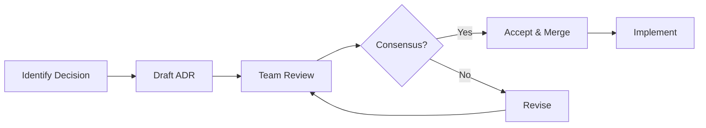

# Architecture Decision Records (ADR)

> Authoritative standards for recording and communicating architecture decisions consistently.

## Purpose

Establish a system for documenting significant architectural decisions, their context, and consequences, enabling future team members to understand why the system evolved as it did.

## Core Principles

1. **Document decisions, not discussions** - ADRs capture the outcome, not the debate
2. **Immutable records** - Supersede rather than modify existing ADRs
3. **Lightweight process** - Quick to write, easy to find
4. **Context is king** - Future readers need to understand the situation
5. **Consequences matter** - Both positive and negative impacts

## When to Write an ADR

### Write an ADR for:

- Choice of technology, framework, or library
- Architectural patterns (microservices, event sourcing, etc.)
- API design decisions
- Database schema decisions
- Security architecture choices
- Integration approaches
- Build/deployment strategies
- Significant refactoring approaches

### Don't write an ADR for:

- Bug fixes
- Minor implementation details
- Formatting/style decisions (use linters)
- Obvious best practices
- Reversible decisions with low impact

## ADR Template

```markdown
# ADR-{number}: {Title}

## Status

{Proposed | Accepted | Deprecated | Superseded by ADR-XXX}

## Date

{YYYY-MM-DD}

## Context

{What is the issue that we're seeing that is motivating this decision or change?
Include relevant constraints, requirements, and forces at play.}

## Decision

{What is the change that we're proposing and/or doing?
State the decision clearly and definitively.}

## Consequences

### Positive

- {Benefit 1}
- {Benefit 2}

### Negative

- {Drawback 1}
- {Drawback 2}

### Neutral

- {Neutral observation}

## Alternatives Considered

### {Alternative 1}

{Brief description and why it was rejected}

### {Alternative 2}

{Brief description and why it was rejected}

## References

- {Link to relevant documentation}
- {Link to related ADRs}
```

## Example ADR

```markdown
# ADR-001: Use PostgreSQL as Primary Database

## Status

Accepted

## Date

2024-01-15

## Context

We are building a multi-tenant SaaS application that requires:
- Strong consistency for financial transactions
- Complex querying capabilities for reporting
- JSON support for flexible schema portions
- Row-level security for tenant isolation
- Mature ecosystem with good tooling

Our team has experience with both PostgreSQL and MySQL. The application
will start with moderate scale (~10K users) but needs to scale to 1M+.

## Decision

We will use PostgreSQL as our primary database, deployed on AWS RDS
with Multi-AZ for high availability.

Specific configuration:
- PostgreSQL 15 (latest stable)
- RDS db.r6g.large initially, with read replicas for reporting
- Row-Level Security for tenant isolation
- pgvector extension for future AI/embedding features

## Consequences

### Positive

- Strong ACID compliance for financial data integrity
- Native JSON/JSONB support for flexible fields
- Row-Level Security eliminates application-level tenant filtering bugs
- Excellent tooling (pgAdmin, psql, Prisma support)
- Team familiarity reduces onboarding time
- pgvector enables future AI features without database migration

### Negative

- More expensive than MySQL on RDS
- Connection pooling (PgBouncer) needed at scale
- Some team members need PostgreSQL-specific training
- Vertical scaling limits may require sharding strategy later

### Neutral

- Migration from other databases would require schema conversion
- Need to establish backup and disaster recovery procedures
- Will need to monitor connection limits as we scale

## Alternatives Considered

### MySQL/Aurora

Rejected because:
- Weaker JSON support (improved in MySQL 8, but still behind)
- No native Row-Level Security
- Team has less experience with MySQL-specific features

### MongoDB

Rejected because:
- Eventual consistency model doesn't fit financial requirements
- Transaction support is newer and less battle-tested
- Schema flexibility is less valuable than initially thought
- Team would need significant retraining

### CockroachDB

Rejected because:
- Higher cost at our current scale
- Less mature ecosystem and tooling
- Overkill for current requirements
- Could revisit if global distribution becomes needed

## References

- [PostgreSQL 15 Release Notes](https://www.postgresql.org/docs/15/release-15.html)
- [AWS RDS Multi-AZ](https://docs.aws.amazon.com/AmazonRDS/latest/UserGuide/Concepts.MultiAZ.html)
- [Row-Level Security](https://www.postgresql.org/docs/current/ddl-rowsecurity.html)
- Related: ADR-002 (Database Migration Strategy)
```

## ADR Directory Structure

```
docs/
└── adr/
    ├── README.md           # Index of all ADRs
    ├── adr-template.md     # Template for new ADRs
    ├── 001-database-choice.md
    ├── 002-api-versioning.md
    ├── 003-authentication-strategy.md
    └── 004-frontend-framework.md
```

## ADR README Template

```markdown
# Architecture Decision Records

This directory contains Architecture Decision Records (ADRs) for {project name}.

## Index

| ADR | Title | Status | Date |
| --- | ----- | ------ | ---- |
| [001](./001-database-choice.md) | Use PostgreSQL as Primary Database | Accepted | 2024-01-15 |
| [002](./002-api-versioning.md) | URL-based API Versioning | Accepted | 2024-01-20 |
| [003](./003-authentication-strategy.md) | JWT with Refresh Tokens | Accepted | 2024-01-25 |
| [004](./004-frontend-framework.md) | Use Next.js for Frontend | Accepted | 2024-02-01 |

## Creating a New ADR

1. Copy `adr-template.md` to `{number}-{title}.md`
2. Fill in all sections
3. Add entry to this README
4. Submit PR for review

## Statuses

- **Proposed**: Under discussion, not yet decided
- **Accepted**: Decision made and implemented
- **Deprecated**: No longer relevant or recommended
- **Superseded**: Replaced by another ADR (link to successor)
```

## ADR Workflow

### Creating an ADR



### Superseding an ADR

```markdown
# ADR-001: Use PostgreSQL (Original)

## Status

Superseded by [ADR-015](./015-migrate-to-cockroachdb.md)

---

# ADR-015: Migrate to CockroachDB

## Status

Accepted

## Context

Our application has grown to require global distribution and
automatic failover that PostgreSQL cannot easily provide.
See ADR-001 for original database decision.

## Decision

Migrate from PostgreSQL to CockroachDB...
```

## Best Practices

### Writing Good ADRs

| Do | Don't |
| -- | ----- |
| Be concise and specific | Write novels |
| Include concrete examples | Be vague |
| Document the context | Assume readers know the history |
| List pros AND cons | Only mention positives |
| Link to related ADRs | Leave decisions isolated |
| Date your decisions | Leave dates blank |

### Maintaining ADRs

1. **Review regularly** - Quarterly check for outdated ADRs
2. **Link in code** - Reference ADRs in relevant code comments
3. **Onboarding material** - Include ADRs in new engineer onboarding
4. **Searchable** - Keep ADRs in version control, not wikis
5. **Blameless** - Focus on decisions, not individuals

## Common ADR Topics

### Technology Choices

- Programming language
- Framework/library selection
- Database technology
- Message queue/event streaming
- Caching solution
- Search engine

### Architecture Patterns

- Monolith vs microservices
- Event sourcing vs CRUD
- Sync vs async communication
- API style (REST, GraphQL, gRPC)
- Data storage patterns

### Infrastructure

- Cloud provider
- Container orchestration
- CI/CD pipeline
- Monitoring/observability
- Deployment strategy

### Development Practices

- Branching strategy
- Testing approach
- Code review process
- Documentation standards

## Checklist

### ADR Process Setup

- [ ] ADR directory created
- [ ] Template available
- [ ] README with index
- [ ] Team aware of process
- [ ] Review process defined

### Individual ADR Quality

- [ ] Clear title
- [ ] Status defined
- [ ] Date included
- [ ] Context explains the problem
- [ ] Decision is definitive
- [ ] Consequences (positive and negative)
- [ ] Alternatives documented
- [ ] References included

### Maintenance

- [ ] ADRs reviewed quarterly
- [ ] Deprecated ADRs marked
- [ ] Superseded ADRs linked
- [ ] Index kept current

## References

- [Michael Nygard's ADR Blog Post](https://cognitect.com/blog/2011/11/15/documenting-architecture-decisions)
- [ADR GitHub Organization](https://adr.github.io/)
- [Spotify Engineering Blog on ADRs](https://engineering.atspotify.com/2020/04/when-should-i-write-an-architecture-decision-record/)
- [Thoughtworks Technology Radar](https://www.thoughtworks.com/radar/techniques/lightweight-architecture-decision-records)
- [adr-tools CLI](https://github.com/npryce/adr-tools)
