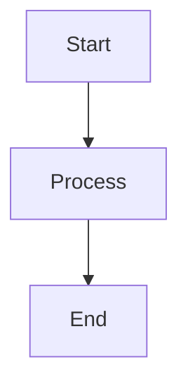
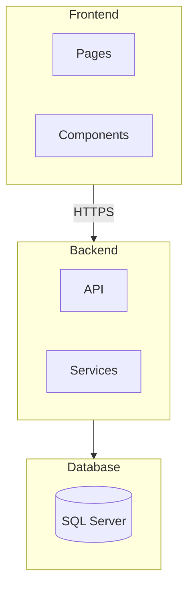
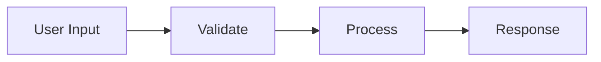
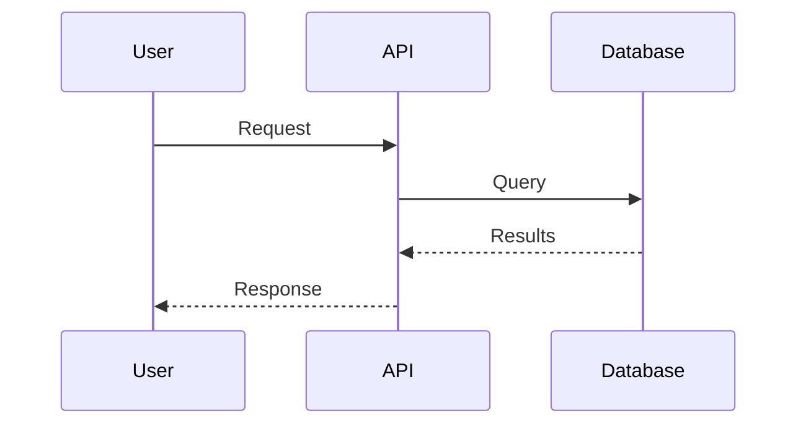
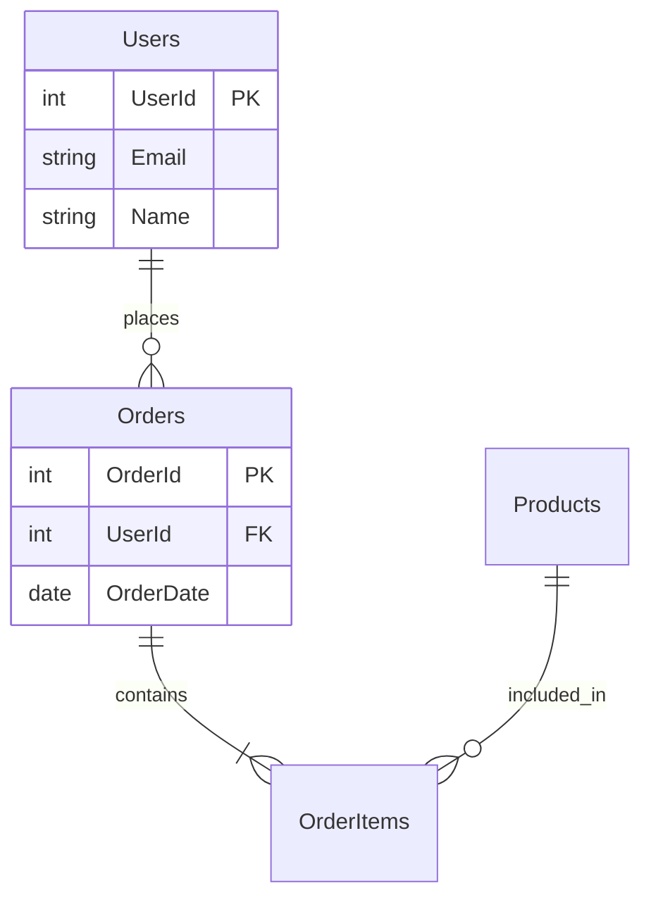

# Documentation Standards

> Authoritative documentation standards for clear, maintainable technical documentation across all projects.

## Purpose

Establish consistent documentation practices that make codebases understandable, maintainable, and accessible to all team members and future contributors.

## Core Principles

1. **Write for the reader** - Consider who will read this and what they need
2. **Keep it current** - Outdated docs are worse than no docs
3. **Be concise** - Say what needs to be said, nothing more
4. **Show, don't tell** - Examples are worth a thousand words
5. **Make it findable** - Good organization beats comprehensive content
6. **Automate when possible** - Generate from code where feasible

## Documentation Site Structure

### Diátaxis Framework (Google/Stripe Pattern)

Documentation should be organized using the Diátaxis framework, which separates content by purpose:

```
┌─────────────────────────────────────────────────────────────┐
│                    PRACTICAL                                 │
├─────────────────────────────────────────────────────────────┤
│  TUTORIALS          │           HOW-TO GUIDES               │
│  (Learning-oriented)│           (Task-oriented)             │
│  "Let me teach you" │           "Here's how to..."          │
│                     │                                       │
│  - Getting Started  │           - Configuration guides      │
│  - Quick starts     │           - Integration guides        │
│  - First project    │           - Deployment guides         │
├─────────────────────┼───────────────────────────────────────┤
│  EXPLANATION        │           REFERENCE                   │
│  (Understanding)    │           (Information-oriented)      │
│  "Here's why..."    │           "Technical specification"   │
│                     │                                       │
│  - Architecture     │           - API reference             │
│  - Concepts         │           - Configuration options     │
│  - Design decisions │           - CLI commands              │
├─────────────────────────────────────────────────────────────┤
│                    THEORETICAL                               │
└─────────────────────────────────────────────────────────────┘
```

### Directory Structure Convention

```text
docs/
├── index.mdx              # Landing page (REQUIRED)
├── getting-started.mdx    # Quick start tutorial
├── guides/                # How-to guides
│   ├── index.mdx          # Section overview (REQUIRED)
│   ├── authentication.mdx
│   └── deployment.mdx
├── concepts/              # Explanatory content
│   ├── index.mdx          # Section overview (REQUIRED)
│   ├── architecture.mdx
│   └── data-model.mdx
├── reference/             # Technical reference
│   ├── index.mdx          # Section overview (REQUIRED)
│   ├── api-reference.mdx
│   └── configuration.mdx
└── changelog.mdx          # Version history
```

### Index Page Requirements

**CRITICAL**: Every directory MUST have an `index.mdx` (or `index.md`) file:

- Nextra automatically navigates to `index` when a parent section is selected
- Do NOT use "overview", "introduction", or "README" as section landing pages
- The `index` file serves as the section's landing page and navigation entry point

```markdown
# Section Title

Brief description of what this section covers.

## In This Section

- [Topic 1](./topic-1) - Brief description
- [Topic 2](./topic-2) - Brief description
- [Topic 3](./topic-3) - Brief description

## Quick Links

Most commonly needed resources in this section.
```

### Navigation Metadata (_meta.ts)

Each directory should have a `_meta.ts` file for Nextra navigation:

```typescript
// _meta.ts
export default {
  index: { title: "Overview" },
  "getting-started": { title: "Getting Started" },
  "---guides": { type: "separator", title: "Guides" },
  guides: { title: "How-To Guides" },
  "---reference": { type: "separator", title: "Reference" },
  reference: { title: "API Reference" },
}
```

### Section Organization Best Practices

| Section Type | Contents | Naming |
| ------------ | -------- | ------ |
| Root | Landing + quick start | `index.mdx`, `getting-started.mdx` |
| Guides | Task-oriented how-tos | `guides/` |
| Concepts | Architectural explanations | `concepts/` |
| Reference | Technical specifications | `reference/` |
| Maintenance | Operational runbooks | `maintenance/` |
| Deployment | Deploy/release guides | `deployment/` |

### Avoid These Anti-Patterns

```markdown
❌ Don't:
- Use "overview.mdx" or "introduction.mdx" as section entry points
- Put dozens of files at the root level of a section
- Mix guide content with reference content
- Create deeply nested structures (max 3 levels)
- Duplicate content across multiple files

✅ Do:
- Use "index.mdx" for all section entry points
- Group related content into subdirectories
- Keep sections focused (5-10 files max per directory)
- Link between sections rather than duplicating
- Use consistent naming conventions
```

## Documentation Types

### Documentation Hierarchy

```
┌─────────────────────────────────────────────────────────────┐
│                      Architecture Docs                       │
│            (System design, ADRs, technical vision)           │
├─────────────────────────────────────────────────────────────┤
│                        API Documentation                     │
│              (OpenAPI specs, endpoint references)            │
├─────────────────────────────────────────────────────────────┤
│                      README & Guides                         │
│            (Getting started, how-tos, tutorials)             │
├─────────────────────────────────────────────────────────────┤
│                      Code Documentation                      │
│           (Inline comments, JSDoc, XML comments)             │
└─────────────────────────────────────────────────────────────┘
```

### When to Document What

| Document Type | Create When | Update When |
| ------------- | ----------- | ----------- |
| README | Project created | Setup changes |
| ADR | Architecture decision made | Decision superseded |
| API docs | Endpoint created | Contract changes |
| Code comments | Complex logic written | Logic changes |
| How-to guides | Common task identified | Process changes |

## Feature Documentation Requirements

### Mandatory Feature Documentation

**CRITICAL**: Every significant feature MUST have technical documentation explaining how it functions.

### Technical Feature Documentation

Each feature requires documentation that includes:

| Element | Required | Description |
| ------- | -------- | ----------- |
| Feature overview | Yes | What the feature does and why it exists |
| Architecture | Yes | How the feature is implemented technically |
| Data flow | Yes | How data moves through the feature |
| API contracts | If applicable | Endpoints, request/response schemas |
| Database schema | If applicable | Tables, relationships, migrations |
| Configuration | Yes | Environment variables, feature flags |
| Dependencies | Yes | External services, packages, internal modules |
| Error handling | Yes | Error states, recovery procedures |

### Feature Documentation Template

```markdown
# Feature: [Feature Name]

## Overview
Brief description of what this feature does and the problem it solves.

## Technical Architecture

### Components
- Component A: [description]
- Component B: [description]

### Data Flow
[Mermaid diagram or description of data flow]

### Database Schema
[Tables and relationships if applicable]

## Configuration

| Setting | Type | Default | Description |
| ------- | ---- | ------- | ----------- |
| `FEATURE_ENABLED` | boolean | false | Enables the feature |

## API Reference
[Endpoints if applicable]

## Error Handling
[Error states and how they're handled]

## Testing
[How to test this feature]
```

### When to Create Feature Documentation

| Trigger | Action |
| ------- | ------ |
| New feature developed | Create documentation before PR merge |
| Feature significantly modified | Update existing documentation |
| Bug reveals undocumented behavior | Document the correct behavior |
| Feature deprecated | Mark documentation as deprecated with migration path |

### Feature Documentation Checklist

- [ ] Overview explains purpose in business terms
- [ ] Architecture section covers all major components
- [ ] Data flow is documented (diagram preferred)
- [ ] All configuration options listed
- [ ] Dependencies identified
- [ ] Error states documented
- [ ] Testing approach described

## README Standards

### Required Sections

```markdown
# Project Name

Brief description of what this project does (1-2 sentences).

## Quick Start

\`\`\`bash
# Minimum commands to get running
git clone <repo>
cd <project>
pnpm install
pnpm dev
\`\`\`

## Prerequisites

- Node.js 20+
- pnpm 8+
- PostgreSQL 15+

## Installation

Step-by-step installation instructions.

## Configuration

### Environment Variables

| Variable | Required | Default | Description |
| -------- | -------- | ------- | ----------- |
| `DATABASE_URL` | Yes | - | PostgreSQL connection string |
| `API_KEY` | Yes | - | External API key |
| `PORT` | No | 3000 | Server port |

### Configuration Files

- `.env` - Environment variables
- `config/default.json` - Default configuration

## Usage

### Running the Application

\`\`\`bash
# Development
pnpm dev

# Production
pnpm build && pnpm start
\`\`\`

### Common Tasks

\`\`\`bash
# Run tests
pnpm test

# Run migrations
pnpm db:migrate

# Generate types
pnpm generate
\`\`\`

## Project Structure

\`\`\`
src/
├── app/          # Next.js app router pages
├── components/   # React components
├── lib/          # Utilities and services
└── types/        # TypeScript types
\`\`\`

## API Reference

Link to API documentation or brief endpoint overview.

## Contributing

Link to CONTRIBUTING.md or brief guidelines.

## License

MIT (or appropriate license)
```

### README Anti-patterns

```markdown
❌ Don't:
- Include auto-generated badges that aren't maintained
- Document every file in the project
- Include outdated screenshots
- Write a novel instead of getting to the point
- Assume reader knows your internal terminology

✅ Do:
- Start with what the project does
- Get reader to "Hello World" in < 5 minutes
- Keep prerequisites and setup accurate
- Link to detailed docs instead of duplicating
- Include troubleshooting for common issues
```

## Code Comments

### Comment Philosophy

```typescript
// ❌ Don't: Comment the obvious
// Increment counter by 1
counter++;

// ❌ Don't: Leave commented-out code
// const oldImplementation = () => { ... }

// ✅ Do: Explain WHY, not WHAT
// Skip validation for admin users to allow emergency data fixes
if (user.role === 'admin') {
  return data;
}

// ✅ Do: Document non-obvious behavior
// Returns null instead of throwing for backwards compatibility
// with the v1 API. TODO: Remove in v3 (see ADR-042)
if (!result) {
  return null;
}

// ✅ Do: Link to external context
// Algorithm from: https://en.wikipedia.org/wiki/Fisher-Yates_shuffle
function shuffle<T>(array: T[]): T[] {
  // ...
}
```

### When to Comment

| Scenario | Comment? | Example |
| -------- | -------- | ------- |
| Complex algorithm | Yes | Link to algorithm explanation |
| Business rule | Yes | Explain the why |
| Workaround/hack | Yes | Explain why and link to issue |
| TODO/FIXME | Yes | Include ticket number |
| Self-evident code | No | `// Get user by ID` |
| API boundary | Yes | JSDoc/XML comments |

### JSDoc Standards (TypeScript)

```typescript
/**
 * Creates a new user account with the given details.
 *
 * @param data - The user registration data
 * @returns The created user without sensitive fields
 * @throws {ConflictError} If email is already registered
 * @throws {ValidationError} If data fails validation
 *
 * @example
 * ```typescript
 * const user = await createUser({
 *   email: 'user@example.com',
 *   name: 'John Doe',
 *   password: 'securePassword123',
 * });
 * ```
 */
export async function createUser(data: CreateUserInput): Promise<User> {
  // Implementation
}

/**
 * Configuration options for the API client.
 */
interface ApiClientConfig {
  /** Base URL for API requests */
  baseUrl: string;

  /** Request timeout in milliseconds @default 30000 */
  timeout?: number;

  /** Custom headers to include in all requests */
  headers?: Record<string, string>;

  /**
   * Retry configuration for failed requests.
   * Set to false to disable retries.
   */
  retry?: RetryConfig | false;
}
```

### XML Comments (.NET)

```csharp
/// <summary>
/// Creates a new user account with the specified details.
/// </summary>
/// <param name="request">The user registration request containing email, name, and password.</param>
/// <param name="cancellationToken">Cancellation token for the operation.</param>
/// <returns>The created user DTO without sensitive fields.</returns>
/// <exception cref="ConflictException">Thrown when the email is already registered.</exception>
/// <exception cref="ValidationException">Thrown when the request data is invalid.</exception>
/// <example>
/// <code>
/// var user = await userService.CreateAsync(new CreateUserRequest
/// {
///     Email = "user@example.com",
///     Name = "John Doe",
///     Password = "securePassword123"
/// });
/// </code>
/// </example>
public async Task<UserDto> CreateAsync(
    CreateUserRequest request,
    CancellationToken cancellationToken = default)
{
    // Implementation
}
```

## API Documentation

### OpenAPI/Swagger Requirements

```yaml
# openapi.yaml
openapi: 3.0.3
info:
  title: My API
  description: |
    Brief description of the API.

    ## Authentication
    All endpoints require Bearer token authentication.

    ## Rate Limiting
    - 100 requests per minute for authenticated users
    - 10 requests per minute for unauthenticated requests

    ## Errors
    All errors follow RFC 7807 Problem Details format.
  version: 1.0.0

paths:
  /api/v1/users:
    post:
      summary: Create a new user
      description: |
        Creates a new user account. The email must be unique across the system.

        **Required permissions:** `users:create`
      operationId: createUser
      tags:
        - Users
      requestBody:
        required: true
        content:
          application/json:
            schema:
              $ref: '#/components/schemas/CreateUserRequest'
            example:
              email: user@example.com
              name: John Doe
              password: SecurePass123!
      responses:
        '201':
          description: User created successfully
          content:
            application/json:
              schema:
                $ref: '#/components/schemas/UserResponse'
        '400':
          $ref: '#/components/responses/ValidationError'
        '409':
          description: Email already exists
          content:
            application/json:
              schema:
                $ref: '#/components/schemas/ProblemDetails'
```

### API Documentation Checklist

```markdown
For each endpoint, document:

- [ ] HTTP method and path
- [ ] Brief summary (one line)
- [ ] Detailed description (if complex)
- [ ] Required permissions/scopes
- [ ] Request parameters (path, query, header)
- [ ] Request body schema with example
- [ ] All possible response codes
- [ ] Response schemas with examples
- [ ] Error responses
```

## Changelog Standards

### Keep a Changelog Format

```markdown
# Changelog

All notable changes to this project will be documented in this file.

The format is based on [Keep a Changelog](https://keepachangelog.com/en/1.0.0/),
and this project adheres to [Semantic Versioning](https://semver.org/spec/v2.0.0.html).

## [Unreleased]

### Added
- New feature description (#123)

### Changed
- Updated dependency X to version Y

### Fixed
- Bug fix description (#456)

## [1.2.0] - 2024-01-15

### Added
- User profile avatars (#100)
- Export data to CSV (#101)

### Changed
- Improved search performance by 50% (#102)
- Updated minimum Node.js version to 20

### Deprecated
- Legacy `/api/v1/search` endpoint (use `/api/v2/search`)

### Removed
- Support for Node.js 18

### Fixed
- Fixed pagination on large datasets (#103)
- Fixed timezone handling in reports (#104)

### Security
- Updated dependencies to patch CVE-2024-XXXX

## [1.1.0] - 2024-01-01
...
```

### Changelog Categories

| Category | Use For |
| -------- | ------- |
| Added | New features |
| Changed | Changes in existing functionality |
| Deprecated | Soon-to-be removed features |
| Removed | Removed features |
| Fixed | Bug fixes |
| Security | Security vulnerability fixes |

## Inline Documentation

### File Headers (When Useful)

```typescript
/**
 * @fileoverview User authentication service handling login, logout, and token refresh.
 *
 * This service integrates with the OAuth provider and maintains session state.
 * See ADR-003 for authentication architecture decisions.
 *
 * @module services/auth
 */
```

### TODO Comments

```typescript
// ✅ Good: Specific, actionable, trackable
// TODO(JIRA-123): Add rate limiting before production launch
// TODO(@username): Refactor this after the Q1 deadline
// FIXME(#456): This breaks with unicode characters

// ❌ Bad: Vague, no tracking
// TODO: Fix this later
// TODO: Make this better
// HACK: This is terrible
```

## Architecture Documentation

### C4 Model Levels

```markdown
## Level 1: System Context

Shows the system in context of users and external systems.

## Level 2: Container

Shows major containers (applications, databases, etc.) within the system.

## Level 3: Component

Shows components within a container.

## Level 4: Code (Optional)

Shows code-level details when necessary.
```

### Architecture Decision Records

See [ADR Template](./adr-template) for the complete ADR standard.

## Writing Style Guide

### Voice and Tone

```markdown
## Guidelines

1. **Use active voice**
   - ✅ "The function returns a user object"
   - ❌ "A user object is returned by the function"

2. **Be direct**
   - ✅ "Run `pnpm install`"
   - ❌ "You should run the command `pnpm install`"

3. **Use present tense**
   - ✅ "This function creates a user"
   - ❌ "This function will create a user"

4. **Be inclusive**
   - ✅ "When you configure the app..."
   - ❌ "When the user configures the app..."

5. **Avoid jargon (or explain it)**
   - ✅ "The ORM (Object-Relational Mapping) converts..."
   - ❌ "The ORM converts..."
```

### Formatting Standards

```markdown
## Code Examples

- Use meaningful variable names, not `foo` or `bar`
- Include imports when relevant
- Show expected output for non-obvious code
- Keep examples minimal but complete

## Lists

- Use numbered lists for sequential steps
- Use bullet points for unordered items
- Limit nesting to 2 levels

## Tables

- Use tables for structured reference information
- Include headers
- Align for readability

## Links

- Use descriptive link text, not "click here"
- ✅ "See the [authentication guide](./auth.md)"
- ❌ "For authentication, [click here](./auth.md)"
```

## MDX/Nextra Compatibility

When writing documentation for Nextra or any MDX-based documentation system, certain characters and patterns require special handling to avoid build errors.

### Characters Requiring Escaping

MDX interprets angle brackets as JSX. Escape them when used outside of code blocks:

| Character | Problem | Solution |
| --------- | ------- | -------- |
| `<` | Interpreted as JSX tag | Escape: `\<` |
| `>` | Can break JSX parsing | Escape: `\>` or use code |
| `{` | Interpreted as JS expression | Escape: `\{` |
| `}` | Closes JS expression | Escape: `\}` |

### Common Patterns to Escape

```markdown
❌ WRONG: Will cause build errors

| Metric | Value |
|--------|-------|
| Response time | <100ms |
| Size | <1MB |
| Range | 1-10 items |

✅ CORRECT: Escaped for MDX

| Metric | Value |
|--------|-------|
| Response time | \<100ms |
| Size | \<1MB |
| Range | 1-10 items |

✅ ALSO CORRECT: Use code formatting

| Metric | Value |
|--------|-------|
| Response time | `<100ms` |
| Size | `<1MB` |
| Range | `1-10 items` |
```

### Safe Patterns (No Escaping Needed)

These patterns are safe without escaping:

```markdown
✅ Inside code blocks (triple backticks)
```yaml
timeout: <30s
```

✅ Inside inline code
The value is `<100ms`.

✅ Comparison operators with spaces
Value is < 100 or > 50

✅ Standard HTML-like tags (recognized JSX)
`<Callout>This works</Callout>`
```

### Validation Before Commit

Run the documentation build to catch MDX errors:

```bash
# Check for MDX compilation errors
pnpm build

# Or run just the docs build if available
pnpm --filter docs build
```

### Quick Reference

| Pattern | Escape? | Example |
| ------- | ------- | ------- |
| `<100ms` in text | Yes | `\<100ms` |
| `<Callout>` component | No | Already valid JSX |
| `{variable}` in text | Yes | `\{variable\}` |
| Code blocks | No | Content is literal |
| Inline code | No | Content is literal |
| `< 100` (spaced) | Usually no | Context-dependent |

## Mermaid Diagrams

Nextra has built-in support for Mermaid diagrams. Use Mermaid for architecture diagrams, flowcharts, sequence diagrams, and entity relationships instead of ASCII art.

### Supported Diagram Types

| Type | Use Case | Syntax |
| ---- | -------- | ------ |
| `flowchart` | Architecture, data flow, process | `flowchart TB/LR` |
| `sequenceDiagram` | API calls, request lifecycle | `sequenceDiagram` |
| `erDiagram` | Database relationships | `erDiagram` |
| `classDiagram` | Class structures | `classDiagram` |
| `stateDiagram-v2` | State machines | `stateDiagram-v2` |

### Basic Syntax

````markdown

````

### Mermaid 11.x Compatibility Rules

**CRITICAL**: Mermaid 11.x has stricter parsing. Follow these rules to avoid parse errors:

1. **NO bracket labels on subgraphs**
   ```
   ✅ subgraph Frontend
   ✅ subgraph MySubgraph
   ❌ subgraph Frontend[Browser]
   ❌ subgraph Frontend["Browser"]
   ```

2. **NO quotes in node labels**
   ```
   ✅ node[Label Text]
   ✅ myNode[My Label]
   ❌ node["Label Text"]
   ❌ node["Label with spaces"]
   ```

3. **NO spaces in bracket labels**
   ```
   ✅ node[LabelText]
   ✅ node[Label_Text]
   ✅ subgraph DataAccess
   ❌ node[Label Text]
   ❌ subgraph Data[Data Access]
   ```

4. **Use simple subgraph names as display labels**
   ```
   ✅ subgraph Frontend
   ✅ subgraph DatabaseLayer
   ❌ subgraph db[Database Layer]
   ```

5. **Use simple node IDs (alphanumeric, no hyphens)**
   ```
   ✅ myNode[Label]
   ✅ dataAccess[Data Access]
   ❌ my-node[Label]
   ❌ data_access[Label]
   ```

6. **Avoid special characters in labels**
   - No parentheses: `(77)` → `77`
   - No slashes: `Next.js / React` → `NextJS React`
   - No colons: `Level 1: Parent` → `Level 1 Parent`

7. **Database cylinders use simple labels**
   ```
   ✅ db[(SQL Server)]
   ✅ mydb[(MyDbContext)]
   ❌ db[("SQL Server")]
   ❌ mydb[(Primary - MyDbContext)]
   ```

8. **Edge labels avoid quotes when possible**
   ```
   ✅ A -->|HTTPS| B
   ✅ A --> B
   ❌ A -->|"HTTPS + JWT"| B
   ```

### Flowchart Examples

#### Architecture Diagram

````markdown

````

#### Data Flow

````markdown

````

### Sequence Diagram Example

````markdown

````

### Entity Relationship Example

````markdown

````

### Troubleshooting Mermaid 11.x Errors

| Error | Cause | Fix |
| ----- | ----- | --- |
| `Parse error... got 'SPACE'` | Spaces in labels or subgraph brackets | Remove spaces or use CamelCase |
| `Expecting 'SEMI'` | Quoted strings in labels | Remove all quotes from labels |
| `subgraph` + `[(` errors | Subgraph with label followed by cylinder nodes | Remove bracket label from subgraph |
| Diagram not rendering | Invalid syntax | Test in Mermaid Live Editor first |
| Subgraph issues | Nested too deeply or has bracket labels | Flatten and remove bracket labels |

### Common Migration from Mermaid 10.x to 11.x

```
# These patterns worked in Mermaid 10.x but FAIL in 11.x:

❌ subgraph Frontend["Next.js Frontend"]
✅ subgraph Frontend

❌ node["Label with spaces"]
✅ node[LabelWithSpaces]

❌ subgraph Data[Database Layer]
      db[("My Database")]
✅ subgraph Database
      db[(MyDatabase)]

❌ A -->|"HTTPS + JWT"| B
✅ A -->|HTTPS| B
```

### Validation

Test diagrams before committing:

1. **Mermaid Live Editor**: https://mermaid.live/ (set version to 11.x)
2. **Local build**: `pnpm build` catches MDX parse errors
3. **Preview**: Check diagram renders in documentation site
4. **Version check**: Ensure Mermaid version in `package.json` matches production

### When to Use Mermaid vs ASCII

| Scenario | Use |
| -------- | --- |
| Architecture diagrams | Mermaid |
| Database relationships | Mermaid |
| API request flow | Mermaid |
| Simple file trees | ASCII (code block) |
| Quick inline reference | ASCII |

## Documentation Maintenance

### Review Cadence

| Document Type | Review Frequency |
| ------------- | ---------------- |
| README | Every release |
| API docs | Every API change |
| Architecture | Quarterly |
| Code comments | During code review |
| ADRs | When decisions change |

### Automation

```yaml
# .github/workflows/docs.yml
name: Documentation

on:
  push:
    branches: [main]
  pull_request:

jobs:
  validate:
    runs-on: ubuntu-latest
    steps:
      - uses: actions/checkout@v4

      - name: Check links
        uses: lycheeverse/lychee-action@v1
        with:
          args: --verbose --no-progress '**/*.md'

      - name: Check spelling
        uses: crate-ci/typos@v1

      - name: Lint markdown
        run: npx markdownlint '**/*.md' --ignore node_modules

      - name: Generate API docs
        run: pnpm docs:api

      - name: Check for outdated docs
        run: |
          # Check if API docs match OpenAPI spec
          pnpm docs:validate
```

## Checklist

### Project Setup

- [ ] README exists with required sections
- [ ] CONTRIBUTING guide exists
- [ ] CHANGELOG maintained
- [ ] ADR directory set up
- [ ] API documentation generated

### Code Documentation

- [ ] Public APIs documented (JSDoc/XML comments)
- [ ] Complex logic has explanatory comments
- [ ] No commented-out code
- [ ] TODOs reference tickets

### Maintenance

- [ ] Documentation reviewed each release
- [ ] Link checker in CI
- [ ] Spelling checker in CI
- [ ] Generated docs up to date

## Multi-Repository Documentation

### Synced Documentation Pattern

For monorepos and multi-app architectures, documentation should be:

1. **Authored at source** - Write docs in the app/package they describe
2. **Synced to central site** - Automated sync to documentation portal
3. **Consistent structure** - Same conventions across all sources

```typescript
// sync-docs.ts configuration pattern
interface DocSource {
  name: string;           // Human-readable name
  source: string;         // Source directory path
  destination: string;    // Target in docs site
  include?: string[];     // File patterns to include
  exclude?: string[];     // Patterns to exclude
}

const DOC_SOURCES: DocSource[] = [
  {
    name: 'Monorepo Core',
    source: '/path/to/monorepo/docs',
    destination: 'core',
  },
  {
    name: 'App A',
    source: '/path/to/monorepo/apps/app-a/docs',
    destination: 'app-a',
  },
  {
    name: 'App B',
    source: '/path/to/monorepo/apps/app-b/docs',
    destination: 'app-b',
  },
];
```

### Source Repository Structure

Each app/package with docs should follow:

```text
app/
├── src/
├── docs/
│   ├── index.mdx          # App overview (REQUIRED)
│   ├── getting-started.mdx
│   ├── changelog.mdx
│   ├── guides/
│   │   ├── index.mdx
│   │   └── ...
│   └── reference/
│       ├── index.mdx
│       └── ...
└── package.json
```

### Sync Script Requirements

```markdown
## Sync Script Behavior

- [ ] Copies .mdx and .md files only
- [ ] Preserves directory structure
- [ ] Preserves _meta.ts files (managed by docs site, not source)
- [ ] Supports --dry-run for preview
- [ ] Supports --clean for full refresh
- [ ] Reports missing sources
- [ ] Handles incremental updates
```

### Cross-Reference Strategy

For linking between synced sections:

```markdown
<!-- Absolute links from docs root -->
See the [Core Architecture](/core/architecture) for system design.

<!-- Relative links within same synced section -->
See [API Reference](./reference/api) for endpoint details.

<!-- External links to source repos -->
View the [source code](https://github.com/org/repo/tree/main/apps/app-a).
```

### Internal Link Standards

**CRITICAL**: Internal links must include the full path from the documentation root, including all parent directories.

#### Base Path Requirement

Before writing any internal links, you MUST know the **base path** for the documentation section. If not provided, **request it before proceeding**.

```markdown
## Required Information

Before generating documentation with internal links, confirm:

1. **Documentation site URL** (e.g., `docs.example.com`)
2. **Section base path** (e.g., `/project-a/`, `/standards/`, `/project-b/`)
3. **Directory structure** within the section
```

#### Link Format Rules

| Link Type | Format | Example |
| --------- | ------ | ------- |
| Same section | Relative | `./guides/setup` or `../reference/api` |
| Cross-section | Absolute with base path | `/project-a/guides/setup` |
| External standards | Full path | `/standards/quality/testing-strategy` |

#### Common Mistakes

```markdown
❌ WRONG: Missing section prefix

- [Architecture](/architecture)
- [Testing Guide](/the-forge/guides/testing)
- [API Reference](/finance/reference/api-reference)

✅ CORRECT: Full path from docs root

- [Architecture](/project-a/concepts/architecture)
- [Testing Guide](/the-forge/guides/testing)
- [API Reference](/finance/reference/api-reference)
```

#### Section Path Examples

| Section | Base Path | Example Link |
| ------- | --------- | ------------ |
| Project A | `/project-a/` | `/project-a/guides/setup` |
| Project B | `/project-b/` | `/project-b/reference/database-schema` |
| Standards | `/standards/` | `/standards/governance/security-guidelines` |
| Project C | `/project-c/` | `/project-c/modules/tasks` |
| Docs Guide | `/docs-guide/` | `/docs-guide/access-control` |

#### Subdirectory Requirements

Many sections have required subdirectories. Always include them:

```markdown
❌ WRONG: Missing subdirectory

/project-a/architecture        # Missing /concepts/
/project-a/testing             # Missing /guides/
/project-b/api-reference       # Missing /reference/
/standards/security-guidelines # Missing /governance/

✅ CORRECT: Full path with subdirectory

/project-a/concepts/architecture
/project-a/guides/testing
/project-b/reference/api-reference
/standards/governance/security-guidelines
```

#### Validation Checklist

Before committing documentation with internal links:

- [ ] Base path confirmed for the documentation section
- [ ] All absolute links include the section prefix (e.g., `/project-a/`)
- [ ] Subdirectory paths included where required (e.g., `/concepts/`, `/guides/`, `/reference/`)
- [ ] Links tested in local development build
- [ ] No orphaned links to non-existent pages

#### AI/LLM Documentation Generation

When using AI tools to generate documentation:

1. **Always specify the base path** in your prompt
2. **Provide the directory structure** if linking to multiple sections
3. **Review generated links** before committing

```markdown
## Prompt Template

Generate documentation for [topic] in the [section-name] section.

Base path: /[section-name]/
Directory structure:
- /[section-name]/guides/
- /[section-name]/concepts/
- /[section-name]/reference/

Use full paths for all internal links.
```

## Standards Inheritance Pattern

### Core Principle

**Global standards are the single source of truth.** Project-specific documentation should reference, not duplicate, global standards.

### When to Create Project Standards Documentation

```markdown
✅ Create project-specific standards ONLY when:
- The project has extensions or additions to global standards
- Project-specific patterns differ from (but don't contradict) global patterns
- Domain-specific conventions require documentation

❌ Do NOT create project-specific standards when:
- The global standards already cover the topic completely
- You would be duplicating global content
- The "extension" is just a rephrasing of global standards
```

### Standards Documentation Hierarchy

```
┌─────────────────────────────────────────────────────────────┐
│                    Global Standards                          │
│        (Single source of truth - external docs site)         │
│        docs/standards/ (symlinked to external site)          │
├─────────────────────────────────────────────────────────────┤
│                 Project Reference Docs                       │
│        (Thin wrappers that link to global standards)         │
│        docs/reference/coding-standards.mdx                   │
├─────────────────────────────────────────────────────────────┤
│              Project-Specific Extensions                     │
│        (Only project-specific additions/patterns)            │
│        When needed, added to project reference docs          │
└─────────────────────────────────────────────────────────────┘
```

### Implementation Pattern

#### Project Setup: Symlink Global Standards

Every project should symlink to the global standards repository:

```bash
# Create symlink to external standards
ln -s /path/to/docs-site/pages/standards docs/standards
```

This makes global standards available at `docs/standards/` within the project.

#### Reference Document Pattern

When a project needs a standards reference page (e.g., `docs/reference/coding-standards.mdx`), use this pattern:

```markdown
# Coding Standards

This project follows the engineering standards defined in the central standards documentation.

## Standards Reference

For comprehensive coding standards, see:

- [TypeScript/Monorepo Coding Standards](../standards/typescript/coding-standards-monorepo) — Core patterns
- [Code Review Guidelines](../standards/quality/code-review-guidelines) — Review practices

## Project-Specific Patterns

<!-- ONLY include this section if there are actual project-specific patterns -->

### Import Conventions

This project uses consolidated shared packages:

\`\`\`typescript
// Always import from shared packages
import { BlogModule } from '@org/backend-core';
import { DataTable } from '@org/ui';
\`\`\`

## Related

- [API Design Standards](./api-design) — API conventions
- [Modules Reference](./modules) — Shared module documentation
```

#### Decision Tree: Should I Create Project Standards?

```
Does the global standards doc exist for this topic?
├── No → Check if topic is universal or project-specific
│        ├── Universal → Consider adding to global standards
│        └── Project-specific → Create in project docs
│
└── Yes → Does project need different/additional patterns?
          ├── No → Just link to global standards (no project doc needed)
          │
          └── Yes → Create thin reference doc that:
                    1. Links to global standards
                    2. Documents ONLY the differences/additions
```

### Anti-Patterns

```markdown
❌ WRONG: Duplicating global standards

<!-- docs/reference/coding-standards.mdx -->
# Coding Standards

## TypeScript Configuration
Enable strict TypeScript configuration in all packages:
[... 200 lines of content copied from global standards ...]

---

✅ CORRECT: Reference with extensions only

<!-- docs/reference/coding-standards.mdx -->
# Coding Standards

This project follows [TypeScript/Monorepo Coding Standards](../standards/typescript/coding-standards-monorepo).

## Project-Specific Patterns

### Shared Package Imports
This monorepo uses consolidated packages. Always import from:
- `@org/backend-core` for NestJS modules
- `@org/ui` for React components
```

### CLAUDE.md Integration

Project CLAUDE.md files should reference standards via the symlink:

```markdown
> **Engineering Standards**: See [docs/standards/](docs/standards/) for authoritative standards.

<!-- NOT absolute paths like /Users/name/path/to/standards/ -->
```

### Examples

#### Example 1: No Project-Specific Standards Needed

If your project follows global standards exactly, you don't need project standards docs:

```
docs/
├── reference/
│   ├── api-reference.mdx    # Project-specific API docs
│   └── modules.mdx          # Project-specific module docs
│   # No coding-standards.mdx needed - just reference docs/standards/
└── standards -> /external/docs/standards  # Symlink
```

In CLAUDE.md:
```markdown
> **Coding Standards**: See [docs/standards/typescript/](docs/standards/typescript/)
```

#### Example 2: Project Has Specific Extensions

If your project has specific patterns that extend global standards:

```
docs/
├── reference/
│   ├── coding-standards.mdx  # Thin wrapper with project extensions
│   ├── api-reference.mdx
│   └── modules.mdx
└── standards -> /external/docs/standards  # Symlink
```

The `coding-standards.mdx` file contains:
- Links to global standards (70% of content is links)
- Project-specific patterns only (30% of content is new)

### Validation Checklist

When creating/reviewing project standards documentation:

- [ ] Does a global standard exist for this topic?
- [ ] If yes, does the project doc LINK to it (not duplicate)?
- [ ] Does the project doc contain ONLY project-specific additions?
- [ ] Would this content be better added to global standards?
- [ ] Is the symlink to global standards in place?
- [ ] Does CLAUDE.md use relative symlink paths?

## References

- [Google Developer Documentation Style Guide](https://developers.google.com/style)
- [Write the Docs](https://www.writethedocs.org/)
- [Keep a Changelog](https://keepachangelog.com/)
- [Conventional Commits](https://www.conventionalcommits.org/)
- [C4 Model](https://c4model.com/)
- [Diátaxis Documentation Framework](https://diataxis.fr/)
